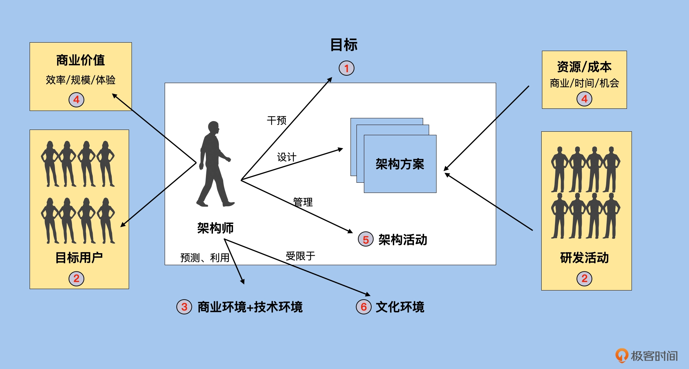

# 郭东白的架构课

### 开篇词｜没有战略意图，就成不了一个顶尖的架构师

所谓战略意图，就是拥有与其资源和能力极不相称的雄心壮志。

该怎么培养自己作为架构师的战略意图呢？

靠记忆和技能学习，是成不了一个好架构师的。真正的架构师成长，主要靠思考力的提升。

### 01｜模块导学：是什么在影响架构活动的成败？

**影响架构活动成败的要素有哪些？**

架构活动就是制定并且交付架构方案的过程。

这个方案需要和企业目标一致，与商业、软件环境相匹配，并且还需要满足各种资源的约束条件。而你作为一个架构师，要在这些方案中找到那个能够最小化资源和成本，最大化商业价值，以及最大化目标用户满意度的方案。最终，你还要组织技术团队交付这个架构设计方案。

中间白色部分是架构师的决策领域；黄色部分指架构师的输入和输出部分；蓝色部分指架构师的工作环境。

当我们把架构师的活动归纳总结后，很容易就能清楚到底是什么在影响整个架构活动的成败。我将它们总结归纳为六个要素，分别是：目标、资源、行为、天时、地利以及人和。

**如何利用生存法则，最大化架构师的成长？**

生存法则指的是我们作为架构师在设计架构方案和组织架构活动时必须要尊重的一些原则。如果违背这些原则，那么作为一个架构师的生存就会受到威胁。

第一条，架构师必须保障整个架构活动有且仅有一个正确的目标。

第二条，架构活动需要尊重和顺应人性。架构活动既要服务用户，也要组织研发人员协同工作。这就意味着架构师必须洞察研发人员和目标用户的人性。从人性角度出发来做决策，才能保障最终面向用户的方案具有长期正确性，以及面向研发同学的实施过程具有可行性。

第三条，架构师永远需要在有限资源下最大化商业价值。

第四条，架构选型必须要考虑到所依赖的商业和技术模块的生命周期。也就是说，架构师要看准技术趋势，一般情况下，要选择已经有规模优势或者是即将有规模优势的技术，而不是选择那些接近衰老期的技术。

第五条，架构师需要在架构活动中不断干预活动的目标和内容，以同时保证整个架构活动可以为企业注入外部适应性。

第六条，架构师需要在一个相对安全的文化环境中探索未知, 只有这样，才有希望找到正确的架构方案。文化环境是架构师最难影响的，因而架构师要有足够的判断力，认清自己所在的文化环境是否有利于探索正确的架构方案，不要在一个错误的环境中浪费自己的宝贵生命。